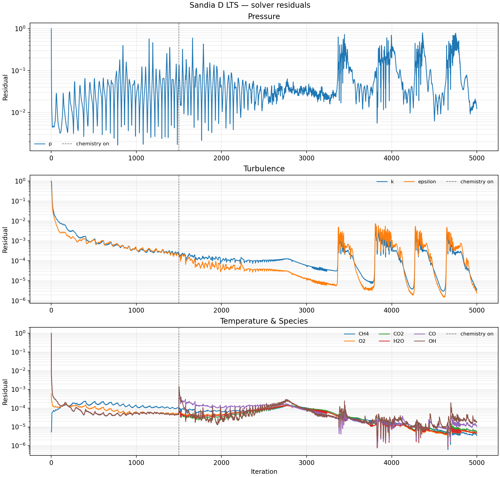
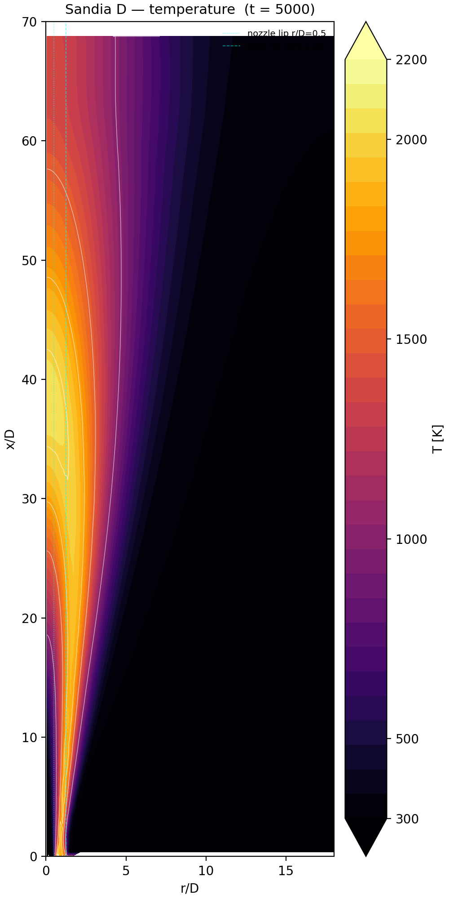
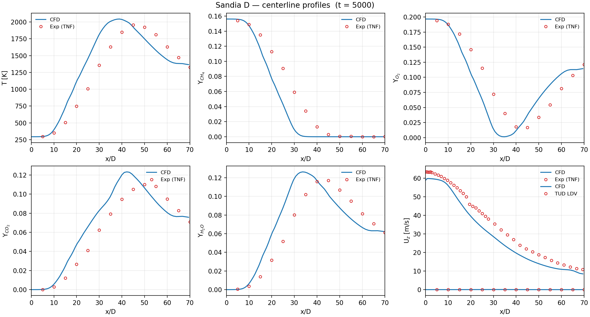
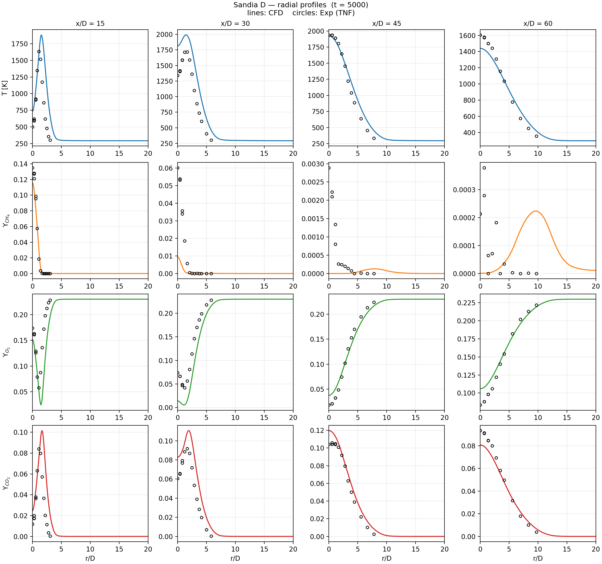

# Sandia Flame D — OpenFOAM LTS Simulation

This repository contains an OpenFOAM 13 simulation of the Sandia Piloted CH₄/air Jet Flame D,
a canonical turbulent reacting-flow benchmark from the TNF Workshop. The case uses the
`multicomponentFluid` solver with Local Time Stepping (LTS), full GRI 3.0 chemistry, EDC
combustion, and P1 radiation. Results are compared against the published Sandia/TUD
experimental dataset.

---

## Contents

```
case/sandiaD_LTS/   OpenFOAM case
scripts/            Post-processing and plotting scripts
images/             Generated figures
.tmp/sandia_ref/    TNF Workshop reference data (pmCDEF.zip, TUD_LDV_DEF.zip)
```

---

## Physical Problem

Sandia Flame D is a piloted methane–air jet flame first described by Barlow & Frank (1998).
A central fuel jet issues from a D = 7.2 mm nozzle surrounded by a lean premixed pilot, both
exhausting into a slow coflowing air stream.

| Parameter | Value |
|---|---|
| Nozzle diameter D | 7.2 mm |
| Fuel | 25% CH₄ / 75% air (by volume) |
| Fuel bulk velocity | 49.6 m/s |
| Fuel Re | 22 400 |
| Pilot inner / outer diameter | 7.7 mm / 18.2 mm |
| Pilot bulk velocity | 11.4 m/s |
| Pilot composition | lean premixed C₂H₂/H₂/CO₂/N₂/air (products, T = 1880 K) |
| Coflow air velocity | 0.9 m/s |
| Coflow temperature | 291 K |

The flame sits close to the stability limit for piloted flames, making it a sensitive test for
turbulence–chemistry interaction models.

---

## Mesh

The mesh is a 2D axisymmetric wedge (5° total angle) built with `blockMesh`.

### Geometry

| Dimension | Value |
|---|---|
| Coordinate system | z = axial, x = radial |
| Axial extent | −100 mm (inlet plenum) to +500 mm (outlet) |
| Axial flame domain (above nozzle exit) | 500 mm = **69.4 D** |
| Radial extent | 0 to 150 mm = **20.8 D** |
| Wedge half-angle | 2.5° |

### Block structure

Six hex blocks cover the inlet plenum and the flame domain:

| Region | Cells (r × θ × z) | Grading |
|---|---|---|
| Inlet: fuel tube | 5 × 1 × 20 | uniform |
| Inlet: annular pilot region | 5 × 1 × 20 | uniform |
| Near-field: fuel core (above nozzle) | 5 × 1 × 70 | z × 2 |
| Near-field: nozzle lip row | 1 × 1 × 70 | z × 2 |
| Near-field: pilot/inner coflow | 5 × 1 × 70 | z × 2 |
| Far-field: outer coflow | 60 × 1 × 70 | r × 3, z × 2 |

**Total cells: 5 170**

The mesh is intentionally coarse — consistent with the published tutorial — and is intended to
demonstrate the solver setup and post-processing workflow rather than a grid-converged result.

---

## Boundary Conditions

### Velocity (U)

| Patch | Type | Value |
|---|---|---|
| `inletCH4` | fixedValue | (0 0 49.6) m/s |
| `inletPilot` | fixedValue | (0 0 11.4) m/s |
| `inletAir` | fixedValue | (0 0 0.9) m/s |
| `wallTube`, `wallOutside` | noSlip / zeroGradient | — |
| `outlet` | pressureInletOutletVelocity | — |
| `frontAndBack_pos/neg` | wedge | — |

### Temperature (T)

| Patch | Type | Value |
|---|---|---|
| `inletCH4` | fixedValue | 294 K |
| `inletPilot` | fixedValue | 1880 K (burnt pilot products) |
| `inletAir` | fixedValue | 291 K |
| Walls | zeroGradient | — |
| `outlet` | inletOutlet | 300 K backflow |

### Pressure (p)

Uniform 1 atm (100 000 Pa) internal field. All inlets and walls use `zeroGradient`. The outlet
uses `entrainmentPressure` to allow air entrainment with a reference of 100 000 Pa.

### Turbulence (k, ε)

Turbulent kinetic energy is set from the measured turbulence intensity at each inlet:

| Patch | Intensity | Mixing length |
|---|---|---|
| `inletCH4` | 4.58% | 0.504 mm |
| `inletPilot` | 6.28% | 0.735 mm |
| `inletAir` | 4.71% | 19.7 mm |

Walls use `kqRWallFunction` / `epsilonWallFunction`. Internal field initialized to
k = 30 m²/s², ε = 30 000 m²/s³ (high values to avoid cold-start stiffness).

### Species (Yi)

| Patch | CH₄ | O₂ | N₂ | All other Yi |
|---|---|---|---|---|
| `inletCH4` | 0.1561 | 0.1966 | 0.6473 | 0 |
| `inletPilot` | 0 | 0 | 0 | 0 (products via T=1880 K) |
| `inletAir` | 0 | 0.233 | 0.767 | 0 |
| Walls | zeroGradient | — | — | — |
| `outlet` | inletOutlet | — | — | — |

`Ydefault` provides a `zeroGradient` / `inletOutlet` template for all tracked species not
explicitly listed.

---

## Thermophysical Properties

| Setting | Value |
|---|---|
| Thermo type | `hePsiThermo` |
| Mixture | `multicomponentMixture` |
| Transport | Sutherland viscosity law |
| Thermodynamics | JANAF polynomials |
| Energy variable | sensible enthalpy |
| Equation of state | ideal gas (perfectGas) |
| Default species | N₂ |

Thermodynamic and transport data for all 36 GRI 3.0 species are read from
`constant/thermo.compressibleGasGRI`, which is generated by `chemkinToFoam` from the GRI 3.0
CHEMKIN input files (`grimech30.dat`, `thermo30.dat`, `transportProperties`).

---

## Chemistry

| Setting | Value |
|---|---|
| Mechanism | GRI 3.0 (36 species, 219 reactions) |
| ODE solver | `seulex` (stiff implicit extrapolation) |
| ODE absolute tolerance | 1 × 10⁻⁸ |
| ODE relative tolerance | 0.1 |
| Initial chemical time step | 1 × 10⁻⁷ s |
| Reduction method | TDAC — DAC (Dynamic Adaptive Chemistry) |
| Tabulation method | TDAC — ISAT (In Situ Adaptive Tabulation) |
| ISAT temperature scale factor | 1000 K |

TDAC combines DAC (which trims the mechanism to the locally active subset of species at each
cell and time step) with ISAT (which replaces repeated ODE integrations with table lookups once
the local composition space has been mapped). This reduces the chemistry cost by roughly an
order of magnitude on a detailed mechanism.

---

## Combustion Model

**Eddy Dissipation Concept (EDC)**, `version v2005` (Gran & Magnussen, 2005 update).

EDC assumes that reactions occur in the fine-structure regions of the turbulent flow field, with
the fine-structure volume fraction and residence time estimated from the local k–ε state. The
detailed chemistry integrations are performed inside each fine-structure reactor using the TDAC
solver described above.

---

## Turbulence Model

Standard **k–ε** model (`kEpsilon`) in RANS mode. Wall functions are applied at `wallTube` and
`wallOutside`. No model constants were changed from the OpenFOAM defaults.

---

## Radiation

**P1 model** with grey-mean absorption/emission coefficients for CO₂, H₂O, CH₄, and O₂.
The absorption coefficients use inverse-temperature polynomial fits over 200–2500 K taken from
the OpenFOAM `greyMeanCombustion` library. Radiation is solved every flow iteration
(`solverFreq 1`). Scattering and soot are disabled.

---

## Numerical Schemes

| Term | Scheme |
|---|---|
| Time derivative (ddt) | `localEuler` (LTS pseudo-transient) |
| Gradient | Gauss linear |
| Divergence — momentum | Gauss `limitedLinearV 1` |
| Divergence — scalars / species / energy | Gauss `limitedLinear 1` |
| Laplacian | Gauss linear orthogonal |
| Surface normal gradient | orthogonal |

`limitedLinear 1` blends between second-order linear and first-order upwind based on a local
gradient limiter, providing boundedness for species mass fractions and enthalpy.

---

## Linear Solvers

| Variable(s) | Solver | Preconditioner | Tolerance | Rel. tol. |
|---|---|---|---|---|
| ρ | diagonal | — | — | — |
| p | PCG | DIC | 1 × 10⁻⁶ | 0.01 |
| U, h, k, ε | PBiCGStab | DILU | 1 × 10⁻⁶ | 0.1 |
| Yᵢ (species) | PBiCGStab | DILU | 1 × 10⁻⁸ | 0.1 |
| G (radiation) | PCG | DIC | 1 × 10⁻⁵ | 0.1 |

---

## PIMPLE Settings

| Parameter | Value |
|---|---|
| nOuterCorrectors | 1 (SIMPLE-like, single outer loop) |
| nCorrectors (pressure) | 2 |
| nNonOrthogonalCorrectors | 0 |
| momentumPredictor | off |
| maxCo | 0.25 |
| alphaTemp | 0.05 (LTS temperature stabilisation) |
| alphaY | 0.05 (LTS species stabilisation) |
| rDeltaTSmoothingCoeff | 0.025 |
| rDeltaTDampingCoeff | 1 |

`alphaTemp` and `alphaY` are LTS-specific controls that limit the pseudo-time-step based on
local changes in temperature and species, preventing excessive jumps in the stiff chemistry
regions.

---

## Initialization and Run Strategy

The solution is computed in two phases to avoid cold-start chemistry instability:

### Phase 1 — Cold flow (iterations 0 → 1500)

Chemistry is disabled (`chemistry off`). The solver establishes the velocity, pressure,
turbulence, and scalar mixing fields from a uniform initial condition
(U = 0.9 m/s, T = 300 K, k = 30 m²/s², ε = 30 000 m²/s³). A single write is made at
iteration 1500. This phase takes the flow from a blank-slate initialization to a
developed mixing field.

The initial species field is set by `setFields`:

| Region | CH₄ | O₂ | N₂ |
|---|---|---|---|
| Domain default | 0 | 0.23 | 0.77 |
| Fuel tube (r < 3.6 mm, z < 0) | 0.1561 | 0.1966 | 0.6473 |

### Phase 2 — Reacting flow (iterations 1500 → 5000)

Chemistry is enabled. The TDAC/ISAT tables built during any prior run in `TDAC/` are reused to
accelerate the early chemistry iterations. Fields are written every 100 iterations.
Profile samples (see below) are written at each write time.

The `Allrun` script handles both phases and detects an existing `1500/` directory to skip
Phase 1 on reruns.

---

## Convergence

Residuals are tracked via the OpenFOAM `residuals` function object for:
U, p, T, CH₄, O₂, CO₂, H₂O, CO, OH, k, ε.



Key observations:

- **k and ε** drop approximately three orders of magnitude during the cold-flow phase and
  remain well converged through Phase 2.
- **Species (CH₄, O₂, CO₂, etc.)** converge to residuals of ~10⁻⁵ by iteration ~200 in
  Phase 1 and are perturbed when chemistry is switched on at iteration 1500, then
  re-converge.
- **Pressure** oscillates throughout — typical of LTS on a fixed-point iteration with a
  coarse mesh, where the pressure equation does not fully converge each iteration.

---

## Post-processing and Sampling

Profiles are extracted at the standard TNF Workshop comparison stations using the OpenFOAM
`sets` function object (`system/sampleDict`), sampling every write interval:

| Sample set | Location |
|---|---|
| `centerline` | z = 0 → 500 mm at r = 0 (501 points) |
| `radial_xD01` … `radial_xD60` | r = 0 → 150 mm at x/D = 1, 2, 3, 7.5, 15, 30, 45, 60 (201 points each) |

Fields sampled: U, T, CH₄, O₂, CO₂, H₂O, CO, OH, H₂, N₂.

Output lands in `postProcessing/sampleDict/<time>/` as space-delimited `.xy` files with a
commented header line.

### Plotting scripts

| Script | Output |
|---|---|
| `scripts/plot_residuals.py` | `images/residuals.png` |
| `scripts/plot_comparison.py` | `images/centerline.png`, `images/radial_profiles.png` |
| `scripts/plot_temperature_contour.py` | `images/temperature_contour.png` |

Run all from the repo root:

```bash
python3 scripts/plot_residuals.py \
  --residuals-dir case/sandiaD_LTS/postProcessing/residuals
python3 scripts/plot_comparison.py
python3 scripts/plot_temperature_contour.py
```

---

## Results

### Temperature contour



The flame structure is clearly visible: a thin annular reaction zone forms just downstream of
the nozzle lip, broadening as fuel and oxidizer mix, and merging on the centreline around
x/D ≈ 40. Peak temperatures reach approximately 2200 K. The cold fuel core persists to roughly
x/D = 20–25 before being consumed.

### Centerline profiles



CFD (solid line) vs. TNF Sandia experimental data (open circles). Key observations:

- **Temperature**: shape and magnitude match well. The simulated peak (~1950 K at x/D ≈ 42)
  is slightly upstream of the experimental peak (~1960 K at x/D ≈ 47), consistent with
  over-predicted mixing rate on the coarse mesh.
- **CH₄**: fuel consumption follows the correct profile but is slightly fast near the
  centreline in the upstream region.
- **O₂**: oxidizer consumption matches reasonably well across the flame.
- **CO₂ and H₂O**: major product profiles are in good agreement in both shape and magnitude.
- **CO**: peak CO is reproduced but at a slightly upstream location, consistent with the
  temperature offset.
- **Axial velocity**: follows the TUD LDV data closely, confirming correct inflow conditions
  and momentum balance.

### Radial profiles



Radial profiles at x/D = 15, 30, 45, and 60. Observations:

- **Temperature**: profiles at x/D = 30–60 match the experimental width and peak location
  well. At x/D = 15 the peak temperature is slightly high and narrow compared to the
  experiment, consistent with the axially-shifted reaction zone.
- **CH₄**: fuel penetrates too far radially at x/D = 15, again reflecting under-mixed
  upstream conditions. At x/D = 30+ the profiles converge toward the data.
- **O₂**: radial oxidizer profiles match across all downstream stations.
- **CO₂**: major product profiles are in good agreement at x/D ≥ 30.

Overall, the coarse mesh reproduces the correct flame length, peak temperatures, and
major species distributions to within ~10–15% of the experimental data. The primary
discrepancy is a slight upstream shift of the reaction zone, a known consequence of the
standard k–ε model over-predicting turbulent mixing in high-Re round jets.

---

## Reference Data

The comparison scripts read from `.tmp/sandia_ref/`, which is not committed to the repo.
Download the two archives from the TNF Workshop and place them there:

```bash
mkdir -p .tmp/sandia_ref
# Download from https://tnfworkshop.org/data-archives/pilotedjet/ch4-air/
# Required files:
#   pmCDEF.zip   — scalar statistics (T, Yi) for flames C/D/E/F
#   TUD_LDV_DEF.zip — TU Darmstadt 2D-LDA velocity data for flames D/E/F
```

| File | Contents |
|---|---|
| `pmCDEF.zip` | T, Yi profiles at centerline (`DCL.Yave`) and radial cuts (`D01`–`D60.Yave`) |
| `TUD_LDV_DEF.zip` | Axial velocity centerline (`TUD_LDV_D.axial`) and radial profiles (`TUD_LDV_D.d*`) |

Reference: Barlow R.S. and Frank J.H. (1998), *Proc. Combust. Inst.* 27:1087–1095.

---

## How to Run

```bash
cd case/sandiaD_LTS
./Allrun
```

The script detects whether a `1500/` directory exists and skips Phase 1 if so.
OpenFOAM 13 must be sourced before running (`source /opt/openfoam13/etc/bashrc`).
